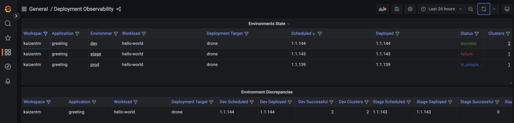
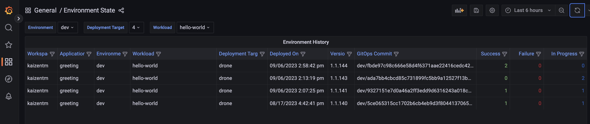
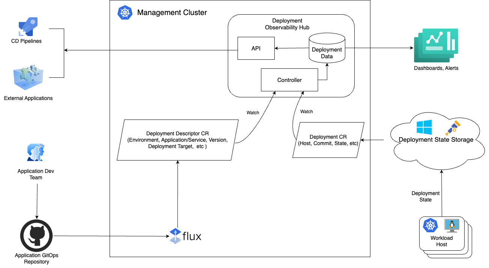

# Kalypso Observability Hub

Kalypso Observability Hub is a central storage that contains deployment data with historical information on workload versions and their deployment state across hosts. This data is used by dashboards and alerts for the deployment monitoring purposes, by the CD pipelines, implementing progressive rollout across environments and by various external systems that make decisions basing on the deployment data. 

## Motivation

Platform and Application Dev teams need a deployment observability solution to perform the following activities:

- monitor what application/service versions are deployed to clusters/hosts in the environments
- compare environments and see deployment discrepancy (e.g. how my "stage" environment is different from "prod")
- track deployment history per environment, per application/service, per microservice 
- compare desired deployment state to the reality and see deployment drift

## Deployment reports

The challenges, mentioned above, can be addressed, to some extent, if Platform and Application Dev teams have dashboards and alerts that provide information as in the following reports:






See the the [mockup examples](./docs/images/DeploymentObservabilityReports.png) backing these reports.

## Architecture

The high level architecture of the solution is represented on the following diagram:



### Components

At high level Deployment Observability Hub consists of `storage`, `API` and `controller`.

#### Storage

Storage is a database containing the deployment observability data. The data can serve as a datasource for the tools, such as Grafana. 
There is not any requirements regarding the exact database implementation. In this implementation, PostgreSQL has been selected. 

The nature of the data to be stored (see the [data model](./docs/images/DeploymentObservabilityLogicalModel.png)) is relational, representing the state of the environments. It's not a time series data. The [reports](./docs/images/DeploymentObservabilityReports.png), that we are targeting to build, are based on correlation of many different entities. Storing this data in a time series database would hardly make sense and querying it with query languages like PromQL would be very hard and cumbersome. With that said, a relational database will make a good fit to store and query the deployment observability hub data.

#### API

External systems, for example GitHub CD workflows, may query the deployment observability hub regarding the state of the rollout. They communicate with the hub via API, exposed with OpenAPI.

#### Controller

Controller is a standard [K8s controller](https://kubernetes.io/docs/concepts/architecture/controller/) that collects data from the deployment descriptors and hosts and saves the data to the hub storage. See the [detailed architecture diagram](./docs/images/deployment-observability-hub.png) unfolding the controller components.

#### Storage data model

See [logical data model](./docs/images/DeploymentObservabilityLogicalModel.png) of the Observability Hub storage.

### Data flow

Deployment Observability Hub is designed to store large amount of deployment data, that is easy to query with complex queries and consume in various dashboards and alerts. 

The data is coming to the observability hub from two different sources.

#### Desired deployment state

High-level information, describing the desired state of the deployments, which includes environments, application versions, deployment targets, etc. is transferred to the observability hub from the application GitOps repositories. Application CI/CD pipelines submit to the GitOps repositories K8s manifests along with the deployment descriptors, describing what these manifests are all about. See [an example](#example) of a deployment descriptor, generated by the CD flow and submitted to an application GitOps repository.

By collecting the deployment descriptors data in the deployment observability hub, we'll be able to provide information about what is supposed to be deployed where across environments. 
The deployment descriptors are delivered to the observability hub K8s cluster from the GitOps repositories by Flux. These resources are watched and processed by the observability hub controller. The controller saves the normalized data into the hub storage.  

#### Real deployment state

The facts of actual deployment are coming from the hosts. The reconcilers on the clusters report to the deployment state storage the compliance status with the GitOps repositories. They report what GitOps commit has been deployed to a host, when and in what status. This deployment state data is pulled to the observability hub and watched by the observability hub controller. 

Depending on the host platform and the reconciler implementation, the delivery channel of the deployment state data to the deployment state storage, nature of the deployment state storage and the path to the deployment observability hub may vary. To name just a few options:

 - Azure Arc GitOPs extension, installed on the workload K8s cluster, reports the deployment state to Azure Resource Graph (ARG). In this case ARG is the deployment state storage. The observability hub controller polls ARG and delivers the deployment state data to the observability hub.
 - Flux exposes Prometheus metrics with the deployment state data, which is delivered to Azure Monitor with any [preferred channel](https://learn.microsoft.com/en-us/azure/azure-monitor/essentials/prometheus-metrics-overview). With this option, Azure Monitor metrics database is the deployment state storage. The observability hub controller polls Azure Monitor and delivers the deployment state data to the observability hub to store it in normalized form.
 - Custom agents on the K8s clusters and VMs report deployment state directly to the observability hub by submitting the deployment custom resource on the observability hub cluster. In this case the deployment state storage is bypassed. The observability hub controller watches the deployment custom resources and updates tables in the database accordingly.   
 - Custom agents on the K8s clusters and VMs deliver the deployment state data on top of OpenTelemetry protocol with a setup of Otel Collectors on the host and the observability hub side. This is the most flexible option that addresses challenges with the network hierarchy, restricted connections, semi-connected clusters and multi-cloud systems. It is also a very robust solution which allows to distribute deployment state data across multiple backends without introducing any heavy dependencies. With this approach, the deployment observability hub is just one of backends receiving the deployment state data.
 - Combination of the options above            


At this point the observability hub implementation is focused on K8s clusters with Azure Arc GitOps extension installed. The observability hub controller provides out-of-the-box functionality to pull deployment state from the Azure Resource Graph.

The "desired" and the "real" deployment states correlate with each other by the means of commit Id and compose the whole picture of the deployment state.

## Observability hub abstractions

### Deployment descriptor

Deployment descriptors are submitted to the application GitOps repository by the CI/CD process along with the deployment manifests. These descriptors are delivered to the observability hub K8s cluster by Flux. Observability hub controller watches deployment descriptors and submits their data to the observability storage.
  
#### Example

```yaml
apiVersion: hub.kalypso.io/v1alpha1
kind: DeploymentDescriptor
metadata:
  name: hello-world-functional-test-0-0-1
spec:
  workload:
    name: hello-world
    source:
        repo: https://github.com/kaizentm/hello-world
        branch: main
        path: .
    application:
        name: greeting-service
        workspace:
            name: kaizentm
  deploymentTarget:
    name: functional-test
    environment: dev
    manifests:
        repo: https://github.com/kaizentm/hello-world-gitops
        branch: dev
        path: functional-test
  workloadVersion:
    version: 0.0.1
    build: build-1
    commit: ca9ee9d0ff9ec52b998fdcf64e128c84ddd0e661
    buildTime: "2023-04-27T23:25:05Z"
```

### Reconciler

Reconciler custom resource contains information about the host, reconciler type, manifests endpoint, commit and deployment state. This resource is watched buy the observability hub controller which submits its data to the observability hub storage. The Reconciler resource can be created on the observability hub clusters in a number of different ways. Refer to the [Real deployment state](#real-deployment-state) section for the possible options.  

#### Example

```yaml
apiVersion: hub.kalypso.io/v1alpha1
kind: Reconciler
metadata:
  name: kalypso-rg-flux-hello-world
spec:
  hostName: kalypso-rg-flux
  type: flux
  manifestsEndpoint: https://github.com/kaizentm/kalypso-gitops/dev/drone
  manifestsStorageType: git  
  deployment:
    gitOpsCommitId: dev/5ce065315cc1702b6cb4eb9d3f804413706570d8
    status: success
    statusMessage: |
      Resource is Ready
```

### ARG

In order to have the observability hub poll Azure Resource Graph, a corresponding custom resource should be created in the observability hub cluster. This resource contains information about what tenant and subscription should be queried and what managed identity should be used for the authentication, assuming the managed identity is enabled on the observability hub cluster. 

There might be multiple ARG resources on the cluster for the use cases when different environments are hosted in different subscriptions or even tenants.

The observability hub controller polls ARG and creates [Reconciler](#reconciler) custom resources with the information about the host and deployment state.

#### Example

```yaml
apiVersion: hub.kalypso.io/v1alpha1
kind: AzureResourceGraph
metadata:
  name: azureresourcegraph-sample
spec:
  subscription: "7be1b9e7-57ca-47ff-b5ab-82e7ccb8c611"
  tenant: "16b3c013-d300-468d-ac64-7eda0820b6d3"  
  managedIdentity: "02552706-98f9-4301-a473-017752fc430b"
  interval: 10s
```  


## Observability hub API
 
 TBD

## Installation
 TBD

## Contributing

This project welcomes contributions and suggestions.  Most contributions require you to agree to a
Contributor License Agreement (CLA) declaring that you have the right to, and actually do, grant us
the rights to use your contribution. For details, visit https://cla.opensource.microsoft.com.

When you submit a pull request, a CLA bot will automatically determine whether you need to provide
a CLA and decorate the PR appropriately (e.g., status check, comment). Simply follow the instructions
provided by the bot. You will only need to do this once across all repos using our CLA.

This project has adopted the [Microsoft Open Source Code of Conduct](https://opensource.microsoft.com/codeofconduct/).
For more information see the [Code of Conduct FAQ](https://opensource.microsoft.com/codeofconduct/faq/) or
contact [opencode@microsoft.com](mailto:opencode@microsoft.com) with any additional questions or comments.

## Trademarks

This project may contain trademarks or logos for projects, products, or services. Authorized use of Microsoft 
trademarks or logos is subject to and must follow 
[Microsoft's Trademark & Brand Guidelines](https://www.microsoft.com/en-us/legal/intellectualproperty/trademarks/usage/general).
Use of Microsoft trademarks or logos in modified versions of this project must not cause confusion or imply Microsoft sponsorship.
Any use of third-party trademarks or logos are subject to those third-party's policies.
