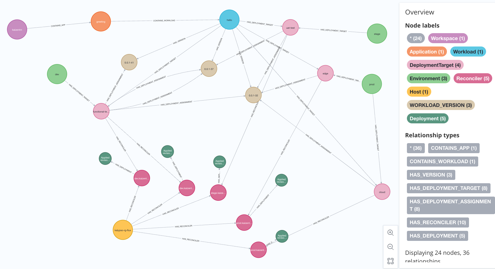

# Neo4j

This folder is contains artefacts created as a part of spike to investigate the suitability of using a graph database like Neo4j instead of Postgres (RDBMS) as the backend database of Kalypso Observability Hub.

## Summary of Findings

Neo4j was found to be a suitable candidate for the backend database of Kalypso Observability Hub, which is represented by the [logical data model](../../docs/images/DeploymentObservabilityLogicalModel.png). The queries for the dashboards were found to be simpler and more intuitive in Neo4j.

The diagram below shows an instance of nodes and relationships for a deployment scenario.

## Contents

1. **scrits/import**: This [folder](./scripts/import/) includes scripts for exporting data from Postgres and creating corresponding ne04j nodes and relationships.
2. **dashboard_queries**: This [folder](./dashboard_queries/) contains neo4j queries for the cluster state, environment state and observability state dashboards.
